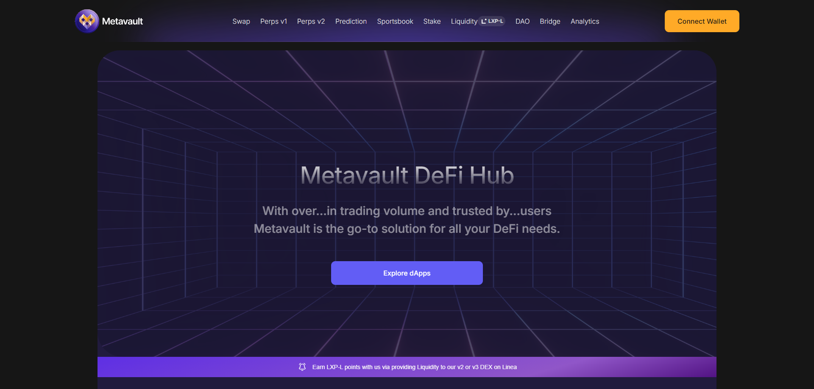

# C3 Frontend work

Developed the frontend for Metavault.Trade, a decentralized exchange offering spot trading, leverage trading, staking, DAO governance, and cross-chain bridging. Leveraged Next.js and Web3.0 to create a seamless user interface on the Polygon blockchain, ensuring deep liquidity, low fees, and secure trading experiences powered by Chainlink oracles.

**Technologies Used**:
- **Frontend**: Next.js, Tailwind CSS, TypeScript
- **Blockchain**: Polygon
- **Web3 Integration**: Web3.js, Wagmi

**Website**: [https://www.c3.app/](https://www.c3.app/)