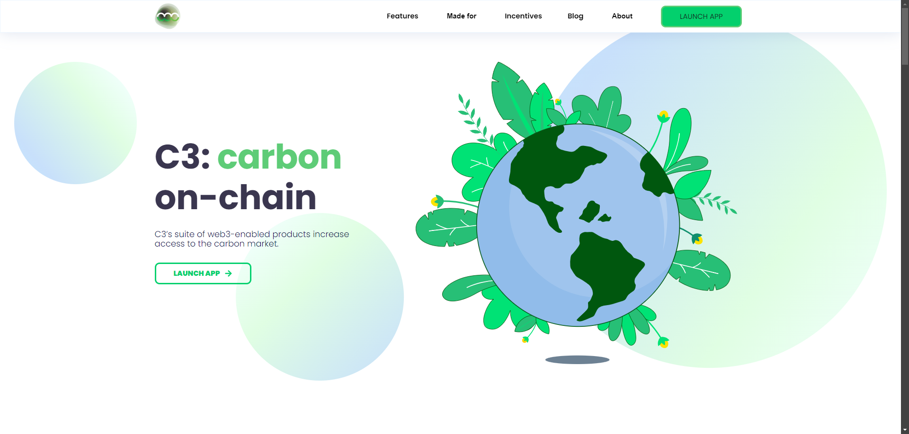

# C3 Frontend work

Developed the frontend for C3, the world’s first automated system in the Voluntary Carbon Market (VCM), leveraging Next.js and Web3.0 technologies. C3 is built on the Polygon blockchain and bridges legacy carbon markets with decentralized finance (DeFi) to enhance transparency, liquidity, and accessibility of carbon credits. The project integrates advanced DeFi mechanics and automated carbon bridging technology to tokenize carbon credits, creating a more transparent and efficient market. My contributions focused on building a user-friendly interface that supports C3's innovative carbon pools and governance mechanisms.

**Technologies Used**:
- **Frontend**: Next.js, Tailwind CSS, TypeScript
- **Blockchain**: Polygon
- **Web3 Integration**: Web3.js, Ether.js

**Website**: [https://www.c3.app/](https://www.c3.app/)