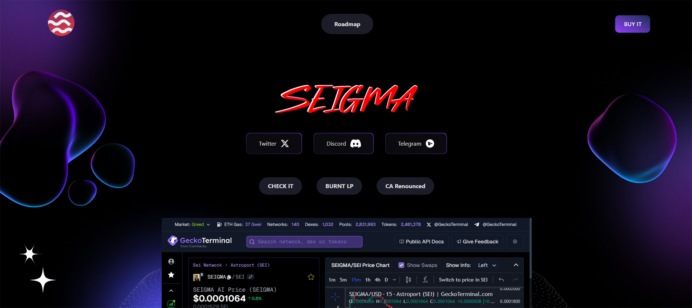
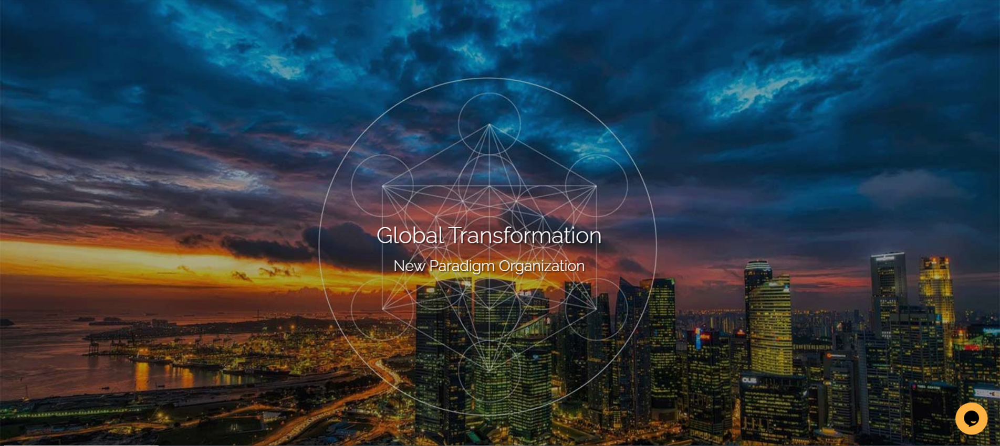
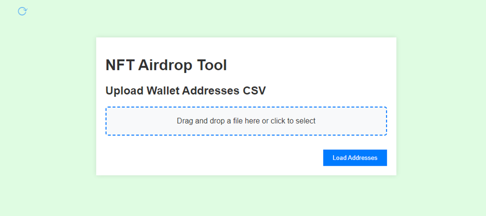
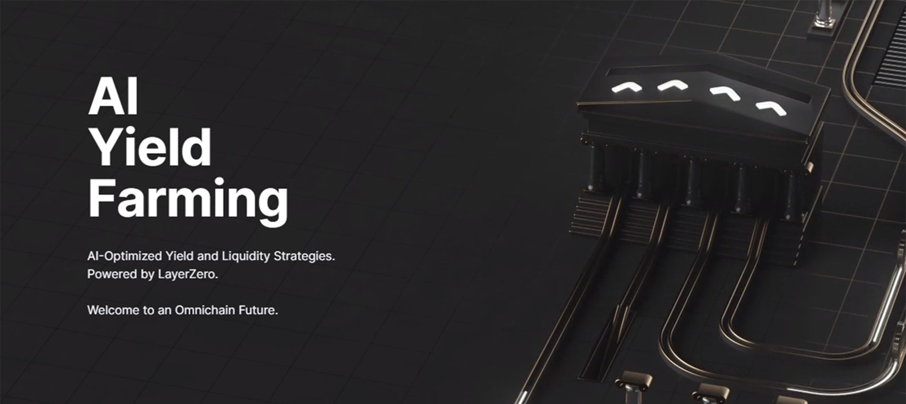

# Private Projects Portfolio

This repository contains a collection of private projects developed by Hiroyuki Kumazawa. The projects range from blockchain applications to AI-driven platforms and collaboration tools. Below is an overview of each project, including their technology stacks and functionalities.

## Projects

### 1. SEIGMA AI

**Description**: Frontend development for the SEIGMA coin website on the SEI Network, a Cosmos-based blockchain network. This project involved integrating a dynamic cryptocurrency chart from GeckoTerminal into a React.js (TypeScript) application.

**Technology Stack**:
- **Frontend**: React.js, TypeScript
- **APIs**: GeckoTerminal
- **Blockchain**: SEI Network

**Website**: [https://seigma.xyz/](https://seigma.xyz/)

### 2. Smartminds Collaboration

**Description**: A collaboration protocol for the Smartminds Social Media platform. The backend is powered by Django, with a React.js (TypeScript) frontend. It features real-time chatting capabilities using MongooseIM, orchestrated with Kubernetes, and hosted on UpCloud.

**Technology Stack**:
- **Backend**: Django
- **Frontend**: React.js, TypeScript
- **Chatting**: MongooseIM
- **Orchestration**: Kubernetes
- **Hosting**: UpCloud

**Website**: [https://smartminds.one/](https://smartminds.one/)

### 3. NFT Airdrop Tool

**Description**: A tool built using React.js (TypeScript) and Electron to manage and execute NFT airdrops on the SEI Network. It allows checking a master address for specific NFTs and airdropping NFTs to multiple addresses.

**Technology Stack**:
- **Frontend**: React.js, TypeScript
- **Desktop**: Electron
- **Blockchain**: SEI Network

### 4. Mozaic

**Description**: The first AI-driven yield farming platform that enables users to earn from EVM-based farming platforms. It leverages Google Cloud Platform services like BigQuery and Google Cloud Functions, alongside APIs from Etherscan and BNBscan.

**Technology Stack**:
- **Backend**: Node.js, Google Cloud Functions, BigQuery
- **Blockchain**: EVM-compatible chains
- **APIs**: Etherscan, BNBscan
- **Hosting**: Google Cloud Platform (GCP)

**Website**: [https://mozaic.finance/](https://mozaic.finance/)
